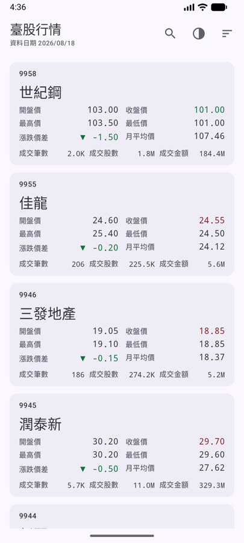
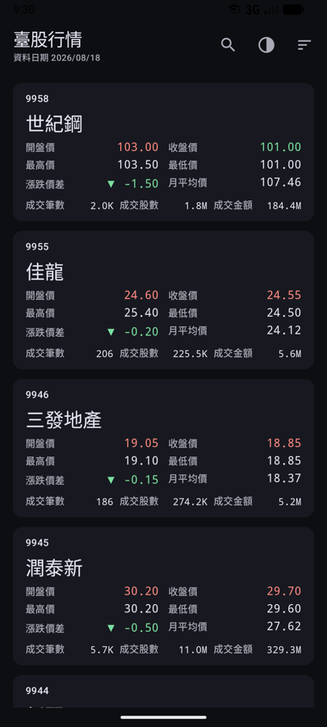
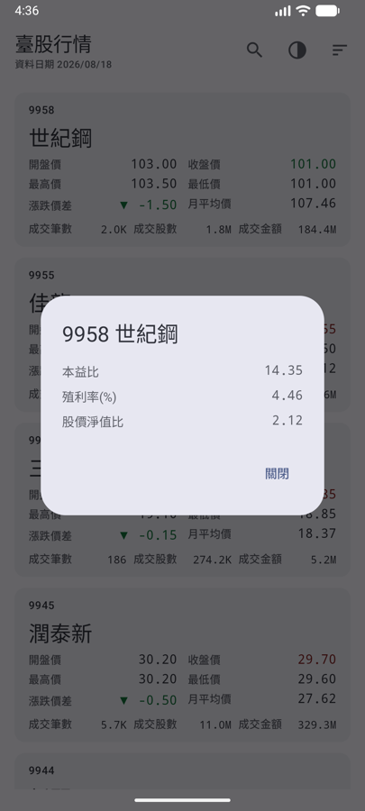
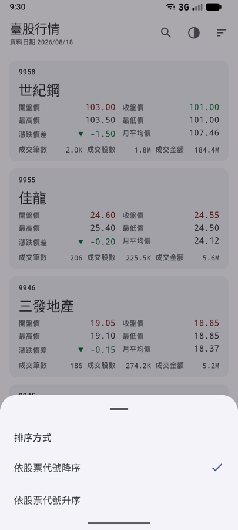
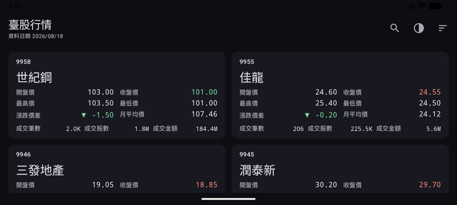

# 臺股行情

以[臺灣證券交易所 OpenAPI](https://openapi.twse.com.tw/) 為資料來源的 Android App。
串接三支日資訊端點，合併成一份可以瀏覽、排序、搜尋的上市個股清單。

demo 影片連結：https://youtu.be/kkT0e57WNSI

| 清單（淺色） | 清單（深色） | 個股資訊 | 排序 |
|---|---|---|---|
|  |  |  |  |

橫向自動變成多欄：



## 執行

```bash
./gradlew :app:installDebug   # 安裝到已連線的裝置
./gradlew test                # 61 個單元／畫面測試
```

需要 JDK 21、Android SDK 36。無需任何 API key。

## 架構

MVVM + 單向資料流，依 clean architecture 切成三個 Gradle module：

```
:app     ← Compose 畫面、ViewModel、DI 組裝
  ↓
:data    ← Retrofit、Room、DataStore、合併規則
  ↓
:domain  ← 模型與純函式（純 JVM module，不認得 Android）
```

`StockRepository` 介面宣告在 `:domain`、實作在 `:data`，所以箭頭永遠是 data → domain。
`:domain` 是純 JVM module，這條規則由 build script 保證，不是靠自律——它的測試也因此不需要 Robolectric。

資料流：

```
三支 API（並行）→ 解析 → 合併 → Room ──▶ ViewModel ──▶ Compose
                                    ▲
                              唯一的真實來源
```

沒有人直接讀取網路回應：`refresh()` 往 Room 寫、`observeStocks()` 從 Room 發，
所以刷新成功與冷啟動走的是同一條路徑，而不是多一條只有網路正常時才會用到的支線。

## 資料處理

**主檔是 `STOCK_DAY_ALL`**，另外兩支 left join 上去。另外兩種選法都會掉資料：以月平均價為主會灌進兩萬多筆沒有成交欄位的權證，以本益比為主會無聲少掉 295 檔交易所不發布本益比的標的。

**join key 是 `(代號, 日期)`，不是只有代號。** 三支端點各自發布、不保證同步。只比代號會把昨天的月平均價接到今天的收盤價上，而那組比較正是紅綠配色的依據——結果不是一個過期的數字，是一個錯的訊號。日期對不上就當作沒有這筆，欄位顯示 `–`。

其他幾條規則：

| 情況 | 處理 |
|---|---|
| 數值解析不出來 | `null`，顯示 `–`。**`null` 不是 `0`**——本益比有兩百多檔是空字串 |
| 民國日期 `1150814` | 轉西元；長度只認 6 與 7 碼（八碼會被讀成民國 1115 年，得到西元 3026 年的合法日期） |
| 代號 `2891C` / `00400A` | 一律當字串處理，`toInt()` 會直接拋例外 |
| 當日無成交 | 開高低收清成 `–` 並標 badge，印 `0.00` 會讓人以為股價歸零 |
| 一列資料壞掉 | 只丟那一列，不賠上另外 1,377 列 |
| 輔助端點掛掉 | 清單照常，對應欄位顯示 `–` |
| 主檔掛掉且有快取 | 保留清單 + snackbar，不把畫面換成一頁錯誤訊息 |
| 主檔掛掉且無快取 | 整頁錯誤 + 重試 |

## 呈現

- 三個數字上色，各自對照自己的基準：收盤價對月平均價、開盤價對收盤價、漲跌價差對 0。**高則紅、低則綠**（台股慣例），缺值不上色。
  開高走低的股票會出現「開盤紅 + 漲跌綠」同時在一張卡上——那是對的，不是矛盾。
- 漲跌價差帶 `▲ / ▼ / －`。顏色不能是唯一訊號（WCAG 1.4.1），紅綠正是紅綠色盲會抹平的那組。
- 漲跌色不從 dynamic color 推導——使用者的桌布很可能給出一個綠色的 `primary`。
- 數字用等寬字體：比例字體的 `1` 比 `0` 窄，一整排價格會隨數值變動左右晃動。

動畫都用框架既有的 API，沒有自訂 brush 或 draw modifier：
切換排序時整列重排（`animateItem`）、骨架與內容溶接（`Crossfade`）、卡片按壓縮放、漲跌顏色補間、
TopAppBar 隨捲動收合、回頂端 FAB、搜尋列展開。

## 測試

61 個測試，`./gradlew test` 全部在 JVM 上跑完，不需要模擬器。

| 模組 | 內容 |
|---|---|
| `:domain` | 排序穩定性與代號字串序、搜尋規則、漲跌判斷、四捨五入與單位進位 |
| `:data` | 民國日期邊界、空字串轉 `null`、四種合併組合、entity round-trip、錯誤對應、repository 的成功／主檔失敗／部分失敗 |
| `:app` | ViewModel 狀態流轉（載入、快取、重試、排序、搜尋 debounce、主題）、Compose 畫面行為 |

畫面測試用 Robolectric，因為「畫面是否照狀態呈現」值得每次 commit 都驗一次，而開模擬器不值得。

## 技術選型

Kotlin 2.4 / AGP 8.13 / compileSdk 36 / minSdk 26 ·
Compose BOM 2026.06.01（material3 1.4.0）· Koin · Retrofit + OkHttp + kotlinx.serialization · Room · DataStore

幾個沒有採用的東西：Navigation Compose（只有一個畫面，dialog 由狀態控制）、Paging（API 沒有分頁，一次全取）、BigDecimal（只做比較與呈現，沒有累加運算，浮點誤差不可達）。

`minSdk 26` 是為了直接用 `java.time` 做民國年轉換，不必引入 desugaring。
AGP 停在 8.x：更新的 AndroidX 在 AAR metadata 宣告需要 AGP 9.1 與 compileSdk 37，會直接讓建置失敗。
